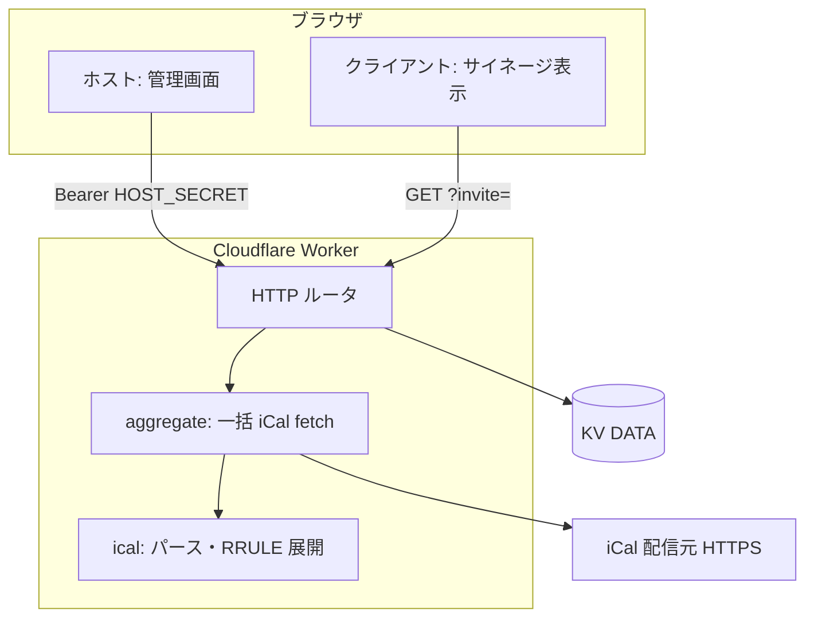

# Calendar-Signage バックエンド・詳細ガイド

プロジェクト全体の概要とクイックスタートはリポジトリ直下の [README.md](../README.md) を参照してください。ここでは **アーキテクチャ**、**データモデル**、**HTTP API**、**KV**、**フロントとの連携**、**運用・トラブルシュート**を詳しくまとめます。

---

## 1. 全体アーキテクチャ



### 1.1 設計上の原則

- **カレンダー取得は Worker のみ**  
  ブラウザから iCal 配信元へ直接 `fetch` したり、CORS 回避プロキシを挟んだりしません。プロキシ失敗や URL 露出の問題を避けます。
- **一括集約**  
  あるプロファイルに複数の iCal URL が登録されている場合、Worker は **並列に取得**し、パース・日付範囲内の繰り返し展開まで行い、**1 レスポンス**でマージ済みイベント配列を返します。
- **単一テナント（MVP）**  
  現在の KV キーは **`tenant:default` 固定**です。1 Worker デプロイあたり論理的に 1 拠点・1 設定束と考えられます。マルチテナント化する場合はキー設計の拡張が必要です。

---

## 2. ディレクトリとソースの対応（worker）

| ファイル | 役割 |
|----------|------|
| `src/index.ts` | `fetch` ハンドラ。パス判定、CORS、`HOST_SECRET` 検証、各エンドポイントの入出力 |
| `src/ical.ts` | `fetchIcalText`（HTTPS のみ許可、`webcal`→`https`）、`parseIcal`、`expand`（RRULE の簡易対応）、`toWire`（ISO8601 文字列化） |
| `src/aggregate.ts` | `aggregateProfileEvents`：プロファイル内の全カレンダーを `Promise.all` で処理し `events` / `calendars`（成否）を返す。`includeSuggestions` で X-WR-CALNAME の提案を返せる |
| `src/store.ts` | `getTenant` / `putTenant` / `getOrInitTenant`、初回用 `createDefaultTenant`（プロファイル 1・招待 1 本） |
| `src/types.ts` | `TenantData`、`Profile`、`DisplayLink`、`WireEvent` 等 |

---

## 3. データモデル（KV に保存する JSON）

KV キー **`tenant:default`** に、次の形の JSON が入ります（概念説明。実際のフィールドは `TenantData` に準拠）。

| フィールド | 説明 |
|------------|------|
| `version` | 楽観的ロック用。`PUT` 時にクライアントが送った `version` がサーバと一致しなければ **409** |
| `profiles[]` | 各 `id`, `name`, `calendars[]`（`id`, `url`, `name`, `color`, `autoName` など） |
| `settings` | `theme`（`light` / `dark`）、`refreshMin`（フロントの自動再取得間隔の目安） |
| `activeProfileId` | ホストのサイネージ画面で「表示中」とするプロファイル |
| `displays[]` | **招待リンク**。`inviteId`（32 バイト hex 等のランダム）と `profileId` の対応 |

### 3.1 招待（Display）とプロファイル

- 1 つの `inviteId` は **ちょうど 1 つの `profileId`** に紐づきます。
- 同じプロファイルを複数端末で表示したい場合は、**同じ invite を共有**するか、**同じ profileId に別 invite を追加**（`POST /api/host/displays`）します。
- **最後の 1 本の招待は削除不可**（クライアントが 0 になるのを防ぐため）。

---

## 4. HTTP API リファレンス

ベース URL はデプロイ先により異なります（例: `https://calendar-signage-api.xxx.workers.dev`）。以下、パスだけ記載します。

共通:

- **CORS**: `Access-Control-Allow-Origin: *`（必要に応じて Worker 側でオリジン制限に変更可能）
- **OPTIONS**: プリフライトに **204** で応答

### 4.1 公開 API（招待 ID のみ・認証なし）

#### `GET /api/public/display?invite=<ID>`

- **用途**: 表示用メタ情報のみ欲しい場合（イベントは別取得する構成向け）
- **レスポンス例**: `profileId`, `profileName`, `settings`, `inviteId`
- **エラー**: `invite` 欠落 **400**、テナントなし **404**、無効な invite **404**

#### `GET /api/public/events?invite=<ID>&from=<ISO>&to=<ISO>`

- **用途**: クライアントサイネージのメイン取得
- **処理**: `invite` → `displays` 解決 → 対象 `profile` の **全 iCal URL を Worker が取得** → パース・`from`〜`to` で展開・マージ
- **`from` / `to`**: 省略時は **現在より 1 ヶ月前 〜 4 ヶ月後**（`index.ts` の `defaultRange`）
- **レスポンス（主なキー）**:
  - `events[]`: `uid`, `title`, `start`, `end`（ISO 文字列）, `allDay`, `loc`, `color`, `calName`
  - `calendars[]`: カレンダー行ごとの `id`, `ok`, `msg`, `count`
  - `profileId`, `profileName`, `settings`（テーマ等）

### 4.2 ホスト API（要 `HOST_SECRET`）

リクエストヘッダ:

```http
Authorization: Bearer <HOST_SECRET と完全一致する文字列>
```

`HOST_SECRET` が Worker に未設定の場合、ホスト系パスは **503**。

#### `GET /api/host/tenant`

- 現在のテナント JSON をそのまま返す
- テナントが KV に無い場合は **初期テナントを生成して保存**してから返す（初回ホストログインで DB ができる）

#### `PUT /api/host/tenant`

- ボディ: テナント全体 JSON（フロントの `S` と同形）
- サーバの `version` とボディの `version` が一致しない場合 **409**（競合）
- 成功時は `version` がインクリメントされたオブジェクトを返す

#### `GET /api/host/events?profileId=<ID>&suggestions=1`

- ホストのサイネージ・管理画面用。**認証必須**
- 指定プロファイルについて `aggregateProfileEvents` と同じ集約
- `suggestions=1` のとき、レスポンスに `suggestedNames`（カレンダー `id` → X-WR-CALNAME）を含め、フロントが保存前に名前候補をマージできる

#### `POST /api/host/calendar-preview`

- ボディ: `{ "url": "https://..." }`
- 1 URL の疎通・件数・カレンダー名の確認（管理画面の「取得」ボタン）

#### `POST /api/host/displays`

- ボディ: `{ "profileId": "p1" }`
- 新しい `inviteId` を生成し `displays` に追加、`version` 更新

#### `DELETE /api/host/displays/<inviteId>`

- 該当招待を削除。残り 0 本になる削除は **400**

### 4.3 ヘルスチェック

#### `GET /api/health`

- `{ "ok": true }` — ルーティング生存確認用

---

## 5. 環境変数・Wrangler

| 名前 | 必須 | 説明 |
|------|------|------|
| `HOST_SECRET` | 本番・ホスト API 利用時 | 十分に長いランダム文字列。`.dev.vars`（ローカル）または `wrangler secret put`（本番） |
| KV `DATA` | はい | `wrangler.toml` の `binding = "DATA"`。本番では **namespace `id` を必ず設定** |

ローカル例:

```bash
cd worker
cp .dev.vars.example .dev.vars
# .dev.vars を編集
npx wrangler dev --local --port 8787
```

本番例:

```bash
npx wrangler kv namespace create calendar-signage-data
# 表示された id を wrangler.toml に記載
npx wrangler secret put HOST_SECRET
npx wrangler deploy
```

---

## 6. フロントエンド（`frontend/index.html`）との対応

### 6.1 API ベース URL の決定順

1. `<meta name="calendar-api-base" content="...">`
2. なければ `localStorage` の `signage_api_base`（管理画面「Worker API の URL」で保存）

### 6.2 モード

| 条件 | 動作 |
|------|------|
| URL に `?invite=` あり | **クライアントモード**。`GET /api/public/events` のみ（＋表示用に meta の theme をレスポンスで上書き可）。管理ボタン非表示 |
| それ以外 | **ホストモード**。`sessionStorage` の `signage_host_token` に入力した SECRET を保持し、`GET/PUT /api/host/*` に `Authorization: Bearer` を付与 |

### 6.3 主なユーザー操作と API

- プロファイル保存・設定保存・アクティブ切替 → `PUT /api/host/tenant`
- サイネージの定期更新（ホスト） → `GET /api/host/events?profileId=...`
- サイネージの定期更新（クライアント） → `GET /api/public/events?invite=...`
- 1 本テスト取得 → `POST /api/host/calendar-preview`
- 全カレンダー一括テスト＋名前候補 → `GET /api/host/events?...&suggestions=1`

### 6.4 ブラウザに残るデータ（フロント実装）

| 保存先 | キー | 用途 |
|--------|------|------|
| `sessionStorage` | `signage_host_token` | ホストが入力した `HOST_SECRET`（タブを閉じると消える） |
| `localStorage` | `signage_api_base` | 管理画面「Worker API の URL」（任意。meta より優先） |

**プロファイル・iCal URL・招待一覧は localStorage に保存しない**（正は常に Worker の KV）。

---

## 7. レスポンス・リクエスト例（参考）

### 7.1 `GET /api/public/events?invite=...`（成功時・構造の例）

```json
{
  "profileId": "p1",
  "profileName": "メインサイネージ",
  "settings": { "theme": "light", "refreshMin": 5 },
  "events": [
    {
      "uid": "event-uid@example.com",
      "title": "打ち合わせ",
      "start": "2026-04-04T10:00:00.000Z",
      "end": "2026-04-04T11:00:00.000Z",
      "allDay": false,
      "loc": "",
      "color": "#1a73e8",
      "calName": "職場カレンダー"
    }
  ],
  "calendars": [
    { "id": "c1700000", "ok": true, "msg": "12 件", "count": 12 }
  ]
}
```

`events[].start` / `end` は **ISO 8601 文字列**。フロントは `new Date(...)` で復元して描画しています。

### 7.2 `PUT /api/host/tenant`

- **リクエスト**: テナント全体 JSON（`version`, `profiles`, `settings`, `activeProfileId`, `displays` など）。管理画面の `S` と同形。
- **レスポンス**: 成功時は **`version` がインクリメント**されたオブジェクト。
- **409**: リクエストの `version` が KV 上の値と一致しない（別端末・別タブで先に保存された）。

### 7.3 日付範囲クエリ `from` / `to`

`GET /api/public/events` および `GET /api/host/events` に任意で付与。

- **両方**指定し、かつどちらも有効な日付として解釈できた場合のみ、その範囲で繰り返しを展開します。
- 省略時や不正時は **現在時刻基準で 1 ヶ月前〜4 ヶ月後**（`worker/src/index.ts` の `defaultRange`）。

---

## 8. 制限事項・既知の挙動

- **RRULE** は DAILY / WEEKLY / MONTHLY / YEARLY の簡易実装です。`BYDAY` 等の詳細ルールは未対応です（元の `index.html` 由来の制限を引き継いでいます）。
- **タイムゾーン**: `DTSTART;TZID=...` の形式（Google Calendar 等が標準で出力）は、指定されたタイムゾーンの壁時計時刻として正しく UTC に変換されます（DST 込み）。`Z` 付きは UTC として解釈。TZID も `Z` も無い値は Worker のランタイム時刻（Cloudflare Workers は常に UTC）とみなすフォールバックです。ローカル日付のみのオールデイはローカル日として扱われます。
- **EXDATE / RECURRENCE-ID**: 繰り返し予定から除外された回（EXDATE）はスキップされ、1回だけ変更された回（RECURRENCE-ID を持つ VEVENT）は元の回を上書きして表示されます。`RANGE=THISANDFUTURE`（それ以降すべてを変更）には未対応です。
- **HTTPS のみ**: Worker の `fetchIcalText` は `https://` の URL のみ許可します（`webcal://` は `https://` に置換）。

---

## 9. トラブルシューティング

| 現象 | 確認すること |
|------|----------------|
| 管理ログイン直後に API エラー | `calendar-api-base` と Worker の URL が一致しているか、Worker が起動しているか |
| 401 Unauthorized | `Authorization` の Bearer が `HOST_SECRET` と完全一致しているか（前後空白なし） |
| 409 on PUT | 別タブで設定を変えていないか。管理画面を再読み込みしてから再編集 |
| クライアントで 404 invite | 招待を削除していないか。管理画面で新規 `POST displays` し URL を再配布 |
| iCal 取得失敗 | URL が HTTPS か、配信元が Worker から到達可能か、認証付き URL はトークン期限 |
| 503 HOST_SECRET 未設定 | Worker に `HOST_SECRET` が入っていない。`.dev.vars` または `wrangler secret put` を確認 |
| CORS エラー | API ベース URL のスキーム・ホスト・ポートがフロントから見た先と一致しているか（`file://` から別ポートへは `*` でもブラウザにより挙動が異なる場合あり） |

---

## 10. セキュリティ・運用

- **HOST_SECRET** はパスワードと同等に扱い、リポジトリ・スクリーンショット・チャットに載せない。
- **招待 ID** は URL に載るため、メールや SNS で流すと同様に「そのプロファイルの予定が読める権利」を渡すことになる。
- 本番では **HTTPS のみ**でフロントと API を提供し、可能なら Worker の CORS を `Access-Control-Allow-Origin: *` から **自サイトオリジン限定**に変更することを推奨（`worker/src/index.ts` の `CORS_HEADERS`）。
- **バックアップ**: 運用では KV の `tenant:default` を定期的にエクスポートする運用（Wrangler KV コマンドやダッシュボード）を検討。

---

## 11. 関連ファイル

- ルート概要: [README.md](../README.md)
- Worker 設定: `worker/wrangler.toml`
- フロント: `frontend/index.html`
